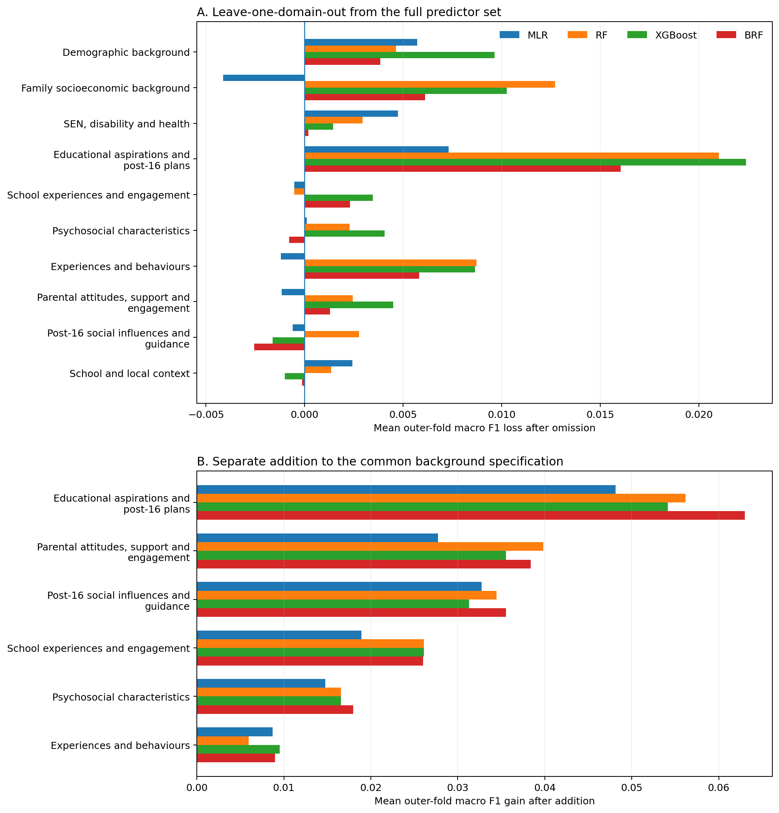
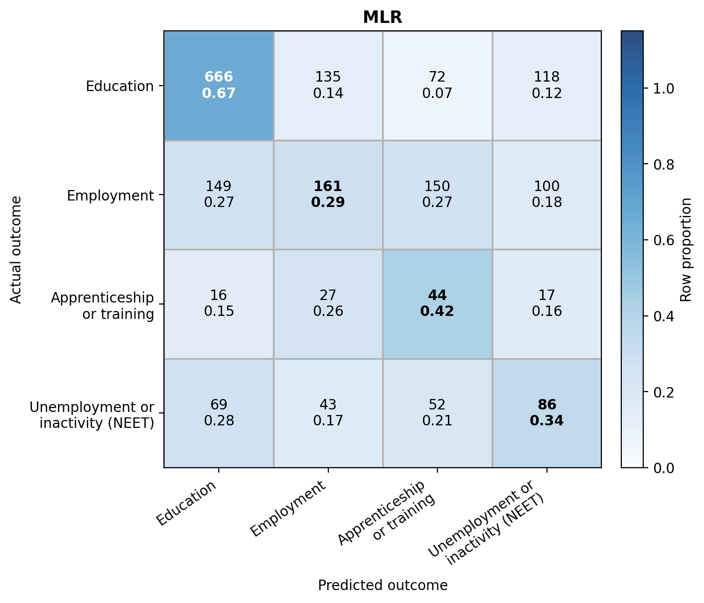
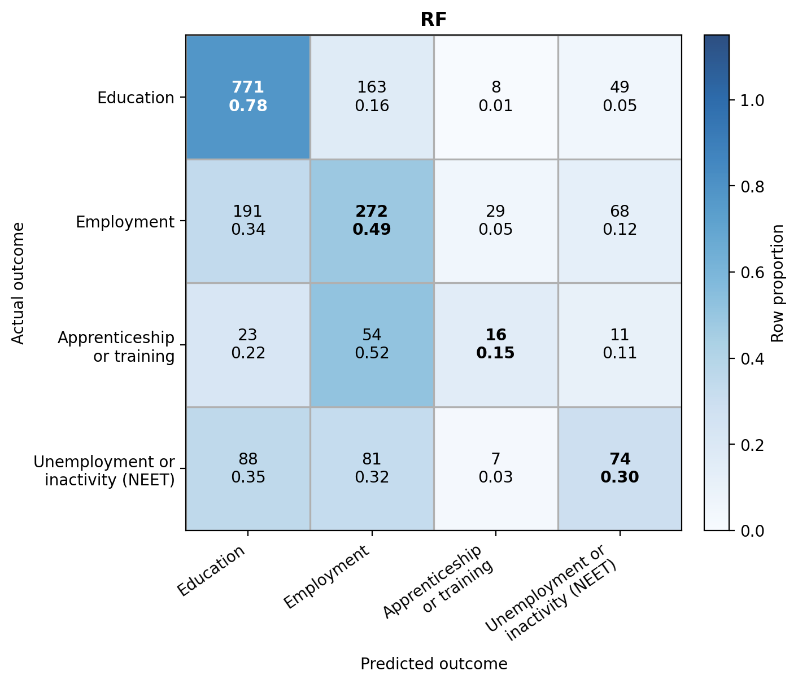
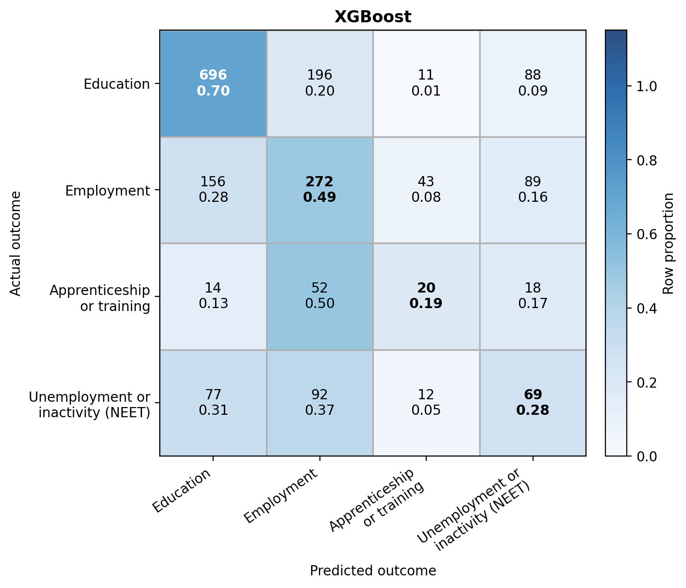
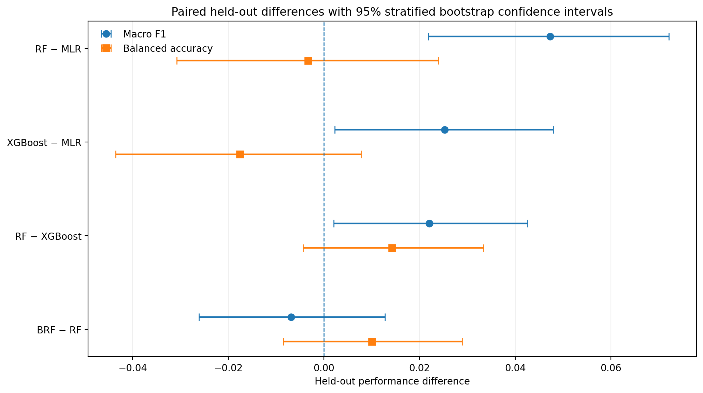
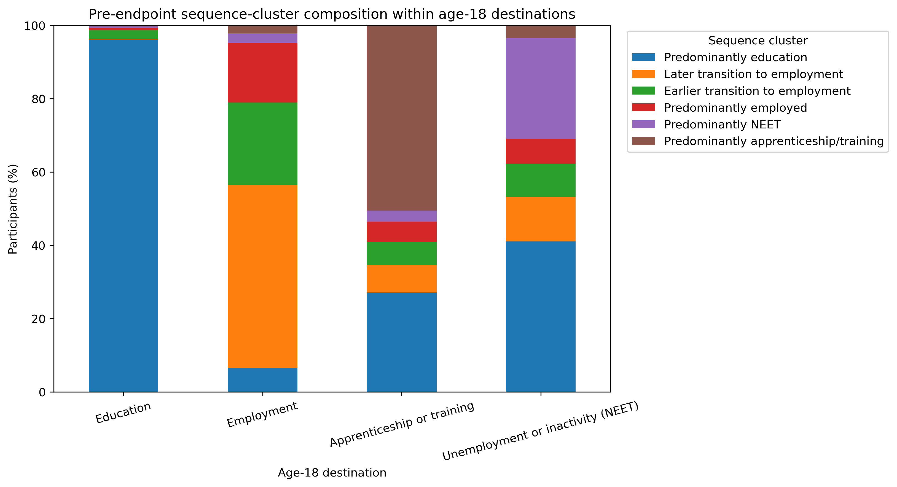
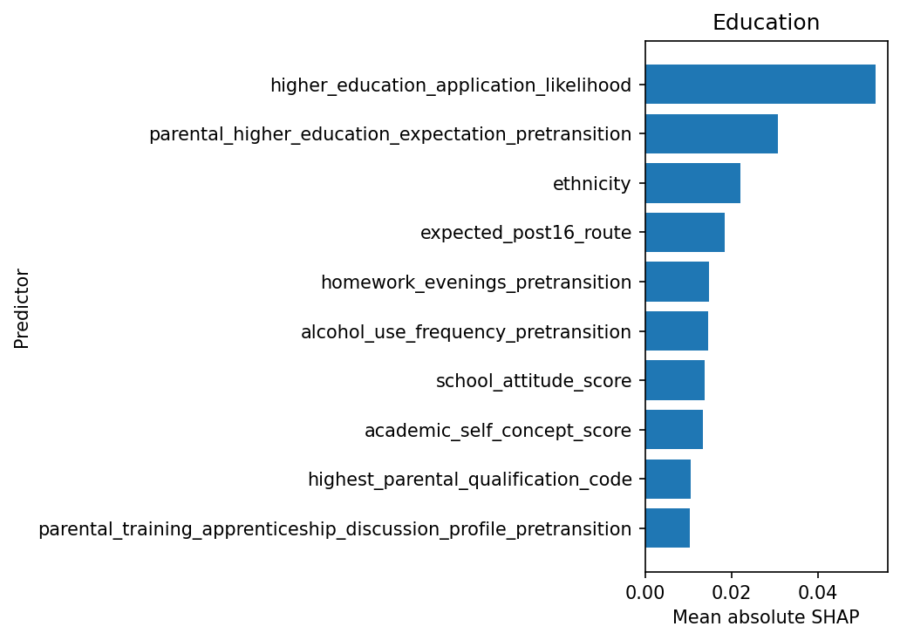
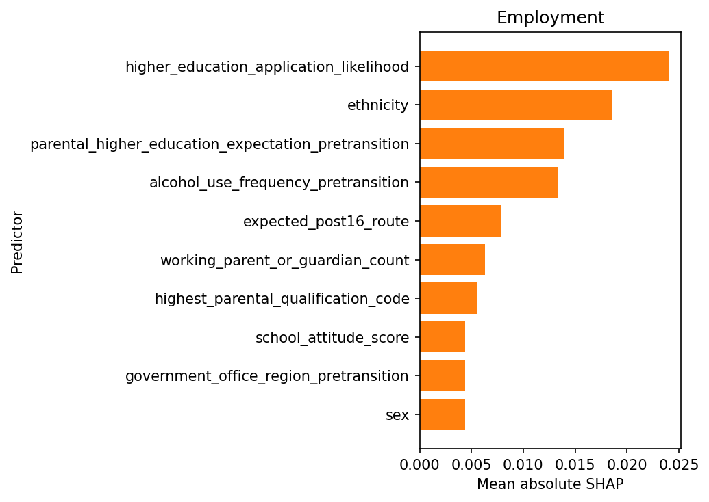
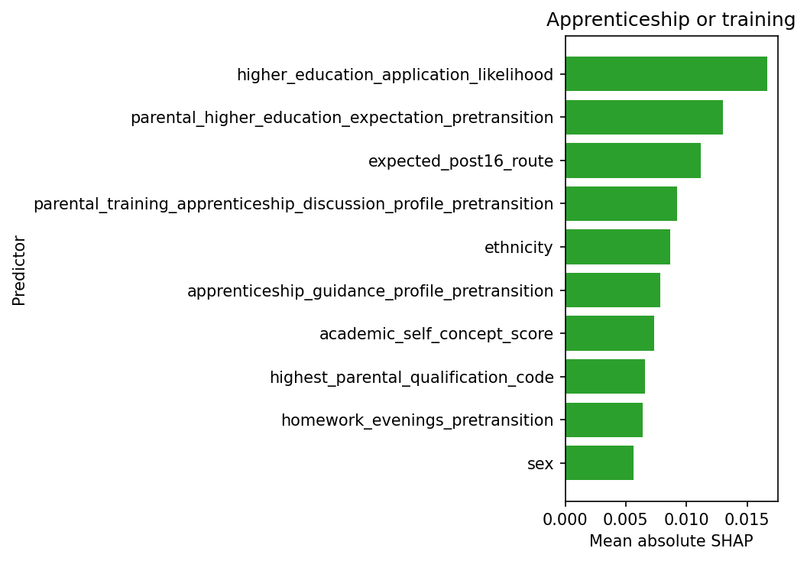
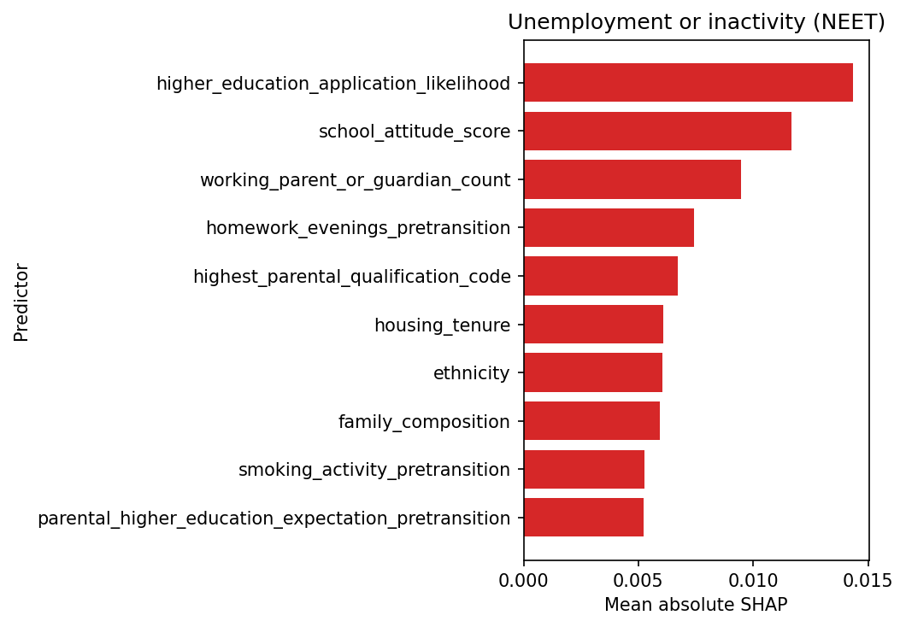

# Predicting Age-18 Destinations Using Pre-Transition Characteristics

*A Comparison of Multinomial Logistic Regression and Machine-Learning Models*

Using **Next Steps (LSYPE1)**

This repository documents the analytical workflow developed for the MSc Data Science project, with Jupyter notebooks, stage summaries and selected aggregate outputs.

- **Project page** — research questions, analytical workflow and main findings
- **Repository** — detailed analysis, notebooks, stage summaries, figures and data-access documentation

**[View the project page →](https://going-091.github.io/next-steps-age18-destination-classification/)**

---

## Study at a glance

| Study feature | Details |
|---|---|
| Data source | Next Steps (LSYPE1) |
| Modelling sample | 9,524 participants |
| Pre-transition predictors | 69 |
| Predictor domains | 10 |
| Age-18 destinations | Education; Employment; Apprenticeship or training; NEET |
| Core models | MLR; RF; XGBoost |
| Supplementary model | Balanced Random Forest (BRF) |
| Development sample | 7,619 |
| Held-out test sample | 1,905 |
| Primary metric | Macro F1 |
| Development evaluation | 5 × 4 nested cross-validation |

---

## Repository structure

- [`notebooks/`](notebooks/) — Jupyter notebooks organised by analysis stage
- [`analysis_summaries/`](analysis_summaries/) — summaries for each analysis stage
- [`assets/`](assets/) — figures and repository visuals
- [`data/`](data/) — data-access information and documentation
- [`docs/`](docs/) — GitHub Pages files and Power BI screenshots
- [`powerbi/`](powerbi/) — Power BI supporting materials

---

## Data source

The project uses **Next Steps**, originally the Longitudinal Study of Young People in England (LSYPE1).

The data are safeguarded. Only anonymised or pre-aggregated outputs are presented in the shared project materials.

**[Data access information →](data/README.md)**

---

## How the analysis is organised

The analytical notebooks are stored in the [`notebooks/`](notebooks/) folder and are numbered in the order in which the analysis was carried out.

Each notebook has a corresponding summary in [`analysis_summaries/`](analysis_summaries/).

Reproducing the full analysis from the source data requires authorised access to the safeguarded Next Steps dataset.

### Research focus

- **Overall predictability of the four age-18 destinations**  
  ↳ [Stage 5: Model development](#5-model-development) · [Stage 6: Final held-out evaluation](#6-final-held-out-evaluation)

- **Differences in performance across destinations**  
  ↳ [Stage 6: Final held-out evaluation](#6-final-held-out-evaluation)

- **RF and XGBoost compared with MLR**  
  ↳ [Stage 5: Model development](#5-model-development) · [Stage 6: Final held-out evaluation](#6-final-held-out-evaluation)

- **Predictor-domain contribution and individual-predictor interpretation**  
  ↳ [Stage 5.1: Predictor-domain contribution](#51-predictor-domain-contribution) · [Stage 8: Individual predictor interpretation](#8-individual-predictor-interpretation)

- **Earlier activity histories as supporting context**  
  ↳ [Stage 7: Pre-endpoint activity histories](#7-pre-endpoint-activity-histories)

**[View the full research questions on the project page →](https://going-091.github.io/next-steps-age18-destination-classification/#research-questions)**

### Analytical workflow

- [Stage 1 — Outcome construction](#1-outcome-construction)
- [Stage 2 — Predictor construction](#2-predictor-construction)
- [Stage 3 — Modelling sample](#3-modelling-sample)
- [Stage 4 — Modelling design and validation](#4-modelling-design-and-validation)
- [Stage 5 — Model development](#5-model-development)
  - [Stage 5.1 — Predictor-domain contribution](#51-predictor-domain-contribution)
  - [Stage 5.2 — Pre-test readiness audit](#52-pre-test-readiness-audit)
- [Stage 6 — Final held-out evaluation](#6-final-held-out-evaluation)
- [Stage 7 — Pre-endpoint activity histories](#7-pre-endpoint-activity-histories)
- [Stage 8 — Individual predictor interpretation](#8-individual-predictor-interpretation)
- [Stage 9 — Power BI](#9-power-bi)

---

# Analysis

## 1. Outcome construction

The outcome was main activity in May 2009 at approximately age 18, grouped into four destinations. Of 11,811 cohort records, 9,767 had a valid outcome.

| Age-18 destination | n | % |
|---|---:|---:|
| Education | 5,132 | 52.54 |
| Employment | 2,831 | 28.99 |
| Apprenticeship or training | 524 | 5.37 |
| Unemployment or inactivity (NEET) | 1,280 | 13.11 |
| **Total** | **9,767** | **100.00** |

The four destinations were retained separately so that classification performance could be examined across classes.

**Files:** [Notebook](notebooks/01-0_stage_1_outcome_construction.ipynb) · [Summary](analysis_summaries/01-0_summary_outcome_construction.md)

---

## 2. Predictor construction

The final predictor set included **69 pre-transition predictors across ten domains**.

| Predictor domain | Predictors |
|---|---:|
| Demographic background | 5 |
| Family socioeconomic background | 7 |
| SEN, disability and health | 8 |
| Educational aspirations and post-16 plans | 2 |
| School experiences and engagement | 9 |
| Psychosocial characteristics | 2 |
| Experiences and behaviours | 7 |
| Parental attitudes, support and engagement | 16 |
| Post-16 social influences and guidance | 10 |
| School and local context | 3 |
| **Total** | **69** |

Direct prior-attainment information was not available under the approved access arrangements.

**Files:** [Notebook](notebooks/02-0_stage_2_predictor_construction.ipynb) · [Summary](analysis_summaries/02-0_summary_predictor_construction.md)

---

## 3. Modelling sample

Among the 9,767 participants with a valid age-18 outcome, 243 had no Wave 1 source record, meaning that most pre-transition predictors were unavailable for them.

| Sample step | Participants |
|---|---:|
| Valid age-18 outcome | 9,767 |
| Excluded: no Wave 1 source record | 243 |
| **Final modelling sample** | **9,524** |

**Files:** [Notebook](notebooks/03_stage_3_modelling_dataset_construction.ipynb) · [Summary](analysis_summaries/03_summary_modelling_dataset_construction.md)

---

## 4. Modelling design and validation

> **Sample split**  
> A stratified 80:20 split created a development sample (n = 7,619) and held-out test sample (n = 1,905).

> **Model development**  
> MLR, RF and XGBoost were developed within 5 × 4 nested cross-validation.

> **Final evaluation**  
> Selected model configurations were fitted on the full development sample and evaluated on the held-out test sample.

The held-out sample was reserved before model development so that final testing remained separate from model selection.

Macro F1 was the primary measure because the four destination classes were unevenly represented. Additional metrics were used to examine performance across different aspects of the multiclass problem.

**Files:** [Notebook](notebooks/04_stage_4_modelling_design_and_data_partitioning.ipynb) · [Summary](analysis_summaries/04_summary_modelling_design_and_data_partitioning.md)

---

## 5. Model development

MLR, RF and XGBoost were compared as the three core models. BRF was included as a supplementary imbalance-aware comparison.

| Model | Development macro F1, mean (SD) |
|---|---:|
| Majority reference | 0.1710 (0.0001) |
| MLR | 0.3943 (0.0100) |
| RF | **0.4517 (0.0230)** |
| XGBoost | 0.4425 (0.0148) |
| BRF | 0.4454 (0.0202) |

RF had the highest mean outer-validation macro F1 among the core models, although the differences between the fitted models were modest.

**Files:** [Notebook](notebooks/05-0_stage_5_model_development.ipynb) · [Summary](analysis_summaries/05-0_summary_model_development.md)

---

### 5.1 Predictor-domain contribution

Predictor domains were examined by removing domains from the full model and by adding selected domains to a common background model.

<strong>📊 Open the predictor-domain contribution figure</strong>

 

  

Educational aspirations and post-16 plans showed the clearest contribution across models. Parental attitudes and support, and post-16 social influences and guidance, also contributed in the separate-addition analysis.

The two analyses provide complementary evidence rather than a single ranking of predictor importance.

**Files:** [Notebook](notebooks/05-1_stage_5_predictor_domain_contribution.ipynb) · [Summary](analysis_summaries/05-1_summary_predictor_domain_contribution.md)

---

### 5.2 Pre-test readiness audit

Before held-out testing, the development workflow was checked to confirm that the data split, model searches and selected configurations were ready for final evaluation.

All required checks passed, and no changes were made before held-out testing.

**Files:** [Notebook](notebooks/05-2_stage_5_pre_test_readiness_audit.ipynb) · [Summary](analysis_summaries/05-2_summary_pre_test_readiness_audit.md)

---

## 6. Final held-out evaluation

The selected models were fitted on all 7,619 development participants and evaluated once on the 1,905-participant held-out test sample.

### Overall performance

| Model | Macro F1 | Balanced accuracy | MCC | Accuracy | Weighted F1 |
|---|---:|---:|---:|---:|---:|
| Majority reference | 0.1711 | 0.2500 | 0.0000 | 0.5202 | 0.3560 |
| MLR | 0.3905 | 0.4317 | 0.2588 | 0.5024 | 0.5196 |
| RF | **0.4378** | 0.4284 | **0.3294** | **0.5948** | **0.5838** |
| XGBoost | 0.4157 | 0.4141 | 0.2909 | 0.5549 | 0.5576 |
| BRF | 0.4309 | **0.4385** | 0.2964 | 0.5559 | 0.5589 |

RF had the highest held-out macro F1 among the core models, but no model performed best across all measures.

### Performance by destination

| Model | Education | Employment | Apprenticeship or training | NEET |
|---|---:|---:|---:|---:|
| MLR | 0.7044 | 0.3477 | 0.2085 | 0.3012 |
| RF | **0.7471** | **0.4814** | 0.1951 | 0.3274 |
| XGBoost | 0.7198 | 0.4642 | 0.2105 | 0.2685 |
| BRF | 0.7252 | 0.4217 | **0.2348** | **0.3419** |

Education was classified most successfully, while Apprenticeship or training was the most difficult across models.

### Confusion matrices

<strong>📊 Open the held-out confusion matrices</strong>

 

### MLR

  

### Random Forest

  

### XGBoost

  

### Paired model differences

<strong>📊 Open the paired model-difference figure</strong>

 

  

RF and XGBoost improved macro F1 over MLR, but the same pattern was not found for balanced accuracy.

The model differences were assessed using 5,000 paired stratified bootstrap resamples.

**Files:** [Notebook](notebooks/06_stage_6_final_held_out_test_evaluation.ipynb) · [Summary](analysis_summaries/06_summary_final_held_out_test_evaluation.md)

---

## 7. Pre-endpoint activity histories

The supporting sequence analysis examined 32 monthly activity states from September 2006 to April 2009.

<strong>📊 Open the activity-history figure</strong>

 

  

- **Education:** 96.17% were in the predominantly education cluster.
- **Employment:** 49.91% were in a later-transition-to-employment cluster, 22.47% in an earlier-transition cluster and 16.35% predominantly employed.
- **Apprenticeship or training:** 50.48% were predominantly apprenticeship/training and 27.15% predominantly education.
- **NEET:** 41.06% were predominantly education and 27.45% predominantly NEET.

The activity histories were used as descriptive context for the classification results, showing the different preceding pathways behind the four age-18 destinations.

**Files:** [Notebook](notebooks/07_stage_7_pre_endpoint_activity_histories_and_age18_destinations.ipynb) · [Summary](analysis_summaries/07_summary_pre_endpoint_activity_histories_and_age18_destinations.md)

---

## 8. Individual predictor interpretation

MLR coefficients and RF SHAP values were used to examine individual predictor contributions. RF provided the main SHAP interpretation because it had the highest held-out macro F1 among the core models.

### Leading overall RF attributions

| Rank | Predictor | Mean absolute SHAP |
|---:|---|---:|
| 1 | Higher-education application likelihood | 0.027092 |
| 2 | Parental higher-education expectation | 0.015734 |
| 3 | Ethnicity | 0.013823 |
| 4 | Expected post-16 route | 0.010447 |
| 5 | Alcohol-use frequency | 0.009232 |
| 6 | School attitude score | 0.008194 |

Higher-education application likelihood had the largest overall RF attribution, while the rest of the leading predictors varied by destination.

<strong>📊 Open the destination-specific RF figures</strong>

 

### Education

  

### Employment

  

### Apprenticeship or training

  

### NEET

  

### RF–XGBoost ranking agreement

| Destination | Spearman rho | Shared top six |
|---|---:|---:|
| Education | 0.876 | 5 |
| Employment | 0.893 | 4 |
| Apprenticeship or training | 0.831 | 3 |
| NEET | 0.866 | 5 |

The ranking patterns were similar across RF and XGBoost, although overlap among the highest-ranked predictors varied by destination.

RF provided the main SHAP interpretation, while XGBoost was used as a supplementary comparison of predictor-ranking patterns. SHAP is interpreted here as model-based attribution.

**Files:** [Notebook](notebooks/08-0_stage_8_individual_predictor_interpretation.ipynb) · [Summary](analysis_summaries/08-0_summary_individual_predictor_interpretation.md)

---

## 9. Power BI

A Power BI report was developed to explore selected aggregate findings across:

- overall model performance
- destination-specific performance
- pre-endpoint activity histories
- predictive information

Only anonymised or pre-aggregated outputs were used in the shared reporting materials.

Public interactive sharing was not available through the institutional Power BI account. Static screenshots of the completed report are available on the project page.

**[View the Power BI report →](https://going-091.github.io/next-steps-age18-destination-classification/powerbi.html)**

**Files:** [Notebook](notebooks/09_stage_9_powerbi_aggregate_exports.ipynb) · [Summary](analysis_summaries/09_note_powerbi_aggregate_exports.md)

---

For a visual overview of the research questions, analytical workflow and main findings, see the **[project page →](https://going-091.github.io/next-steps-age18-destination-classification/)**.

 

Generative AI was used as a conversational support tool during the development of the technical artefacts. All analytical decisions, outputs and references were reviewed and verified by me.
